# Online Boutique — Déploiement AWS Self-Managed avec GitOps

## Vue d'ensemble

Ce projet présente le déploiement de **Online Boutique**, une application e-commerce composée de microservices, sur une infrastructure AWS construite et administrée manuellement.

L'objectif est de mettre en place une chaîne DevOps complète : **Infrastructure as Code, CI/CD, sécurité, registre d'images, GitOps, Kubernetes, monitoring et alerting intelligent**.

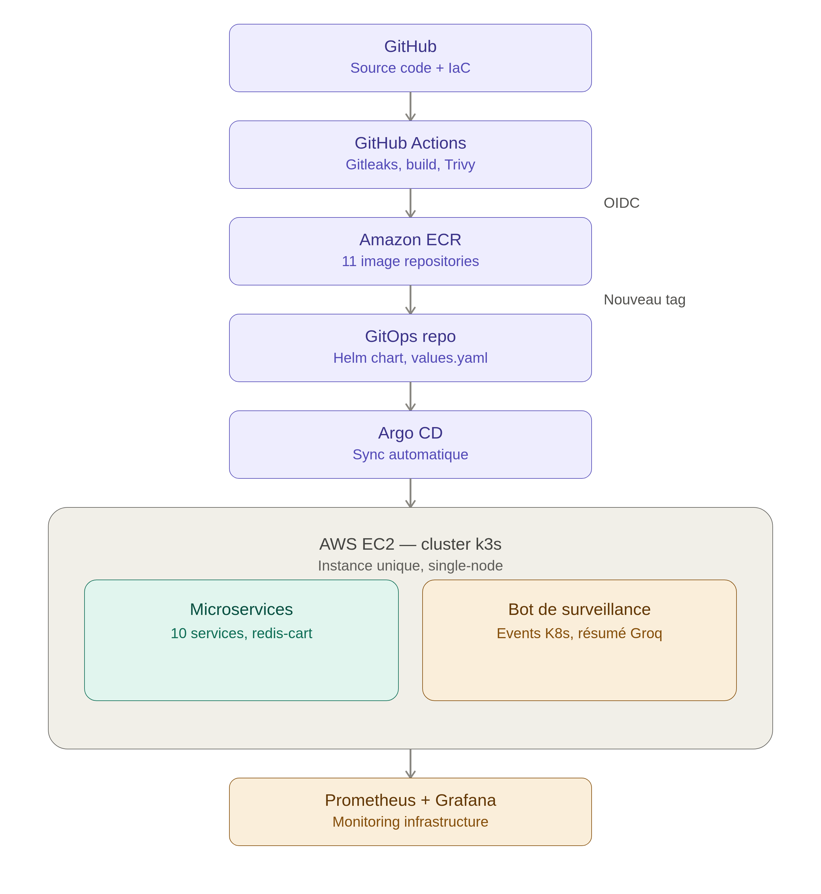

> Basé sur le projet open source [Google Online Boutique](https://github.com/GoogleCloudPlatform/microservices-demo).

---

## Pourquoi ce projet ?

L'objectif de ce projet est d'aller au-delà d'un simple déploiement sur une plateforme cloud managée.

Au lieu d'utiliser directement des services managés tels que **EKS**, l'infrastructure Kubernetes est installée et configurée sur une instance AWS EC2 avec **k3s**.

Cette approche permet de mieux comprendre chaque composant de l'architecture :

* Infrastructure AWS avec Terraform
* Configuration réseau et Security Groups
* Kubernetes et orchestration des conteneurs
* Registre d'images Docker avec Amazon ECR
* Authentification sécurisée entre GitHub Actions et AWS (OIDC)
* CI/CD et automatisation
* GitOps avec Argo CD
* Monitoring avec Prometheus et Grafana
* Alerting intelligent avec un bot IA (Groq) et Telegram

L'objectif principal est de construire une architecture **DevOps complète et reproductible**, tout en comprenant le fonctionnement des différentes briques.

---

# Microservices déployés

Le projet original Online Boutique compte 11 microservices. Dans ce déploiement :

| Service | Rôle |
|---|---|
| frontend | Interface web, orchestration des appels |
| cartservice | Panier d'achat (Redis) |
| productcatalogservice | Catalogue produits |
| checkoutservice | Orchestration de la commande |
| currencyservice | Conversion de devises |
| shippingservice | Calcul des frais de livraison |
| paymentservice | Simulation du paiement |
| emailservice | Confirmation de commande |
| adservice | Bandeaux publicitaires |
| recommendationservice | Suggestions de produits |

**`loadgenerator`** reste désactivé : il ne fait que générer du trafic de test artificiel, sans utilité en usage réel.

Au total : **10 microservices + le bot de surveillance = 11 images** construites, scannées et déployées via le pipeline CI/CD.

---


### Communication interne entre les microservices

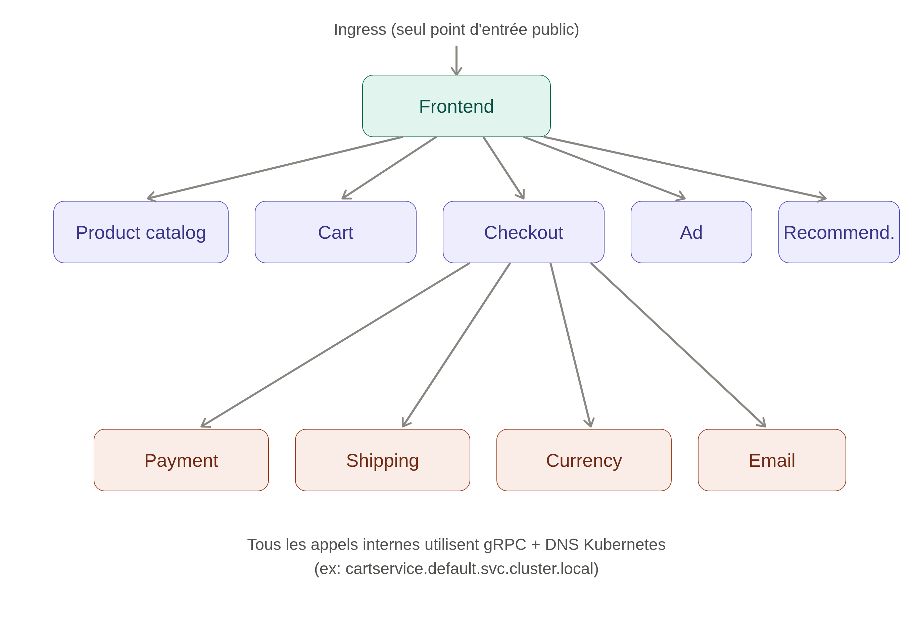

Tous les appels entre microservices se font en interne, via gRPC et le DNS Kubernetes (ex: `cartservice.default.svc.cluster.local`) — aucun trafic inter-services ne transite par Internet. Seul le frontend est exposé publiquement, via un Ingress Traefik.

### Chaîne d'alerting (fonctionnelle)

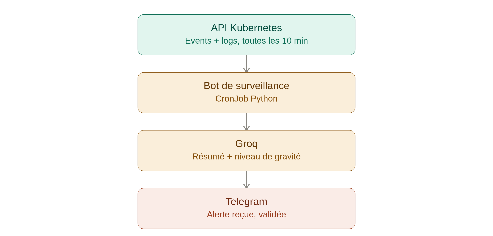

Un `CronJob` Kubernetes interroge toutes les 10 minutes l'API Kubernetes (événements anormaux, logs filtrés sur des motifs d'erreur), envoie le contexte à **Groq** pour un résumé en français avec niveau de gravité, puis notifie sur **Telegram**. Ce mécanisme a été testé et validé en conditions réelles.

---

# Choix d'architecture

## Pourquoi k3s au lieu d'EKS ?

Amazon EKS est une solution Kubernetes managée qui simplifie la gestion du control plane, mais facture ce control plane séparément des instances de calcul.

Dans ce projet, **k3s** a été choisi afin de :

* Comprendre l'installation et l'administration d'un cluster Kubernetes de bout en bout
* Réduire les coûts (une seule instance EC2, pas de frais de control plane managé)
* Contrôler directement chaque paramètre du cluster
* Construire une infrastructure Kubernetes depuis zéro, à des fins d'apprentissage

## Pourquoi GitOps avec Argo CD ?

Avec GitOps, Git devient la **source de vérité** de l'infrastructure applicative.

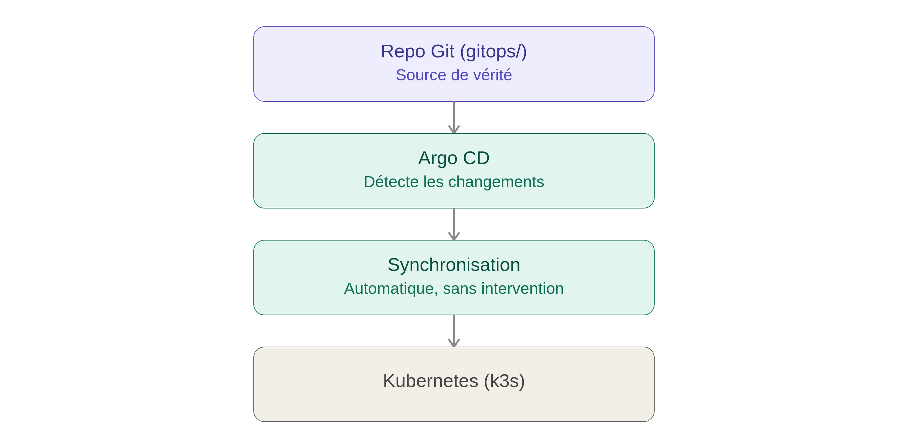

Avantages :

* Déploiements reproductibles et traçables
* Historique complet des changements (chaque déploiement = un commit)
* Synchronisation automatique, sans intervention manuelle
* Rollback basé sur Git (revenir à un commit = revenir à un état de déploiement)

## Pourquoi AWS OIDC ?

GitHub Actions s'authentifie auprès d'AWS grâce à **OpenID Connect (OIDC)**, évitant le stockage de clés AWS permanentes dans les secrets GitHub.

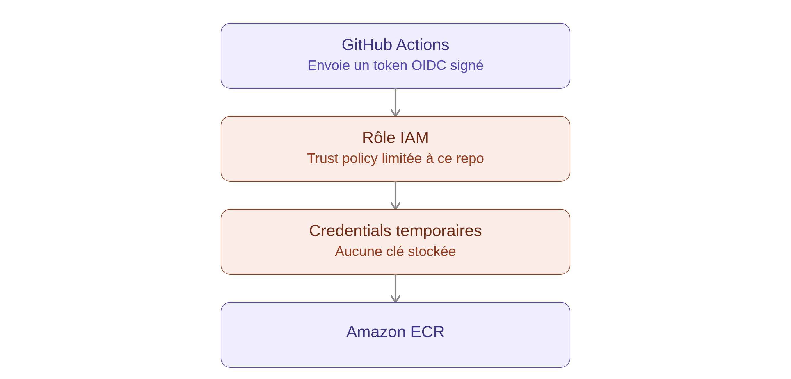

---

# Stack technique

| Technologie | Utilisation |
|---|---|
| AWS EC2 | Hébergement de l'infrastructure |
| AWS ECR | Stockage des images Docker |
| AWS IAM | Gestion des permissions |
| AWS OIDC | Authentification GitHub → AWS |
| Terraform | Infrastructure as Code |
| Docker | Conteneurisation |
| Kubernetes / k3s | Orchestration des conteneurs |
| Helm | Gestion des déploiements Kubernetes |
| GitHub Actions | Pipeline CI |
| Argo CD | GitOps / Déploiement continu |
| Prometheus | Monitoring et collecte des métriques |
| Grafana | Visualisation des métriques |
| Alertmanager (partiel) | Gestion des alertes basées sur seuils |
| Trivy | Analyse de vulnérabilités des images |
| Gitleaks | Détection de secrets dans le code |
| Telegram | Canal de notification |
| Groq | Résumé IA des erreurs détectées |

---

# Fonctionnalités

## Infrastructure as Code

L'infrastructure AWS est définie avec Terraform : instance EC2, VPC, Security Group, rôles IAM, fournisseur OIDC, et les 11 repositories ECR. L'ensemble est reproductible via `terraform apply`.

Le script de démarrage de l'instance (`user_data.sh`) installe **automatiquement**, sans intervention manuelle :

* k3s, avec le credential provider ECR intégré dès le premier démarrage
* Helm
* Argo CD
* Prometheus + Grafana (kube-prometheus-stack)

## Pipeline CI

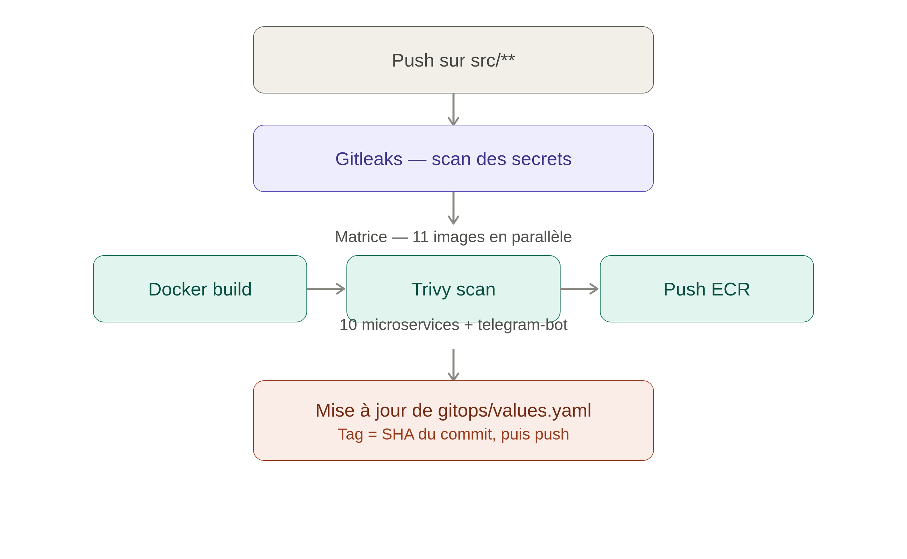

```text
Developer Push (src/**)
      │
      ▼
GitHub Actions
      │
      ├── Gitleaks (scan des secrets)
      │
      ├── Pour chacun des 11 services (matrice, en parallèle) :
      │     ├── Docker Build
      │     ├── Trivy (scan de vulnérabilités)
      │     └── Push vers Amazon ECR
      │
      └── Mise à jour automatique de gitops/values.yaml
            (nouveau tag = SHA du commit) + commit + push
```

## GitOps avec Argo CD

**Séparation stricte des responsabilités** : GitHub Actions ne se connecte jamais au cluster Kubernetes et ne déploie jamais rien directement. Son rôle s'arrête à la mise à jour du fichier `gitops/values.yaml` (nouveau tag d'image) et au push de ce changement vers Git.

C'est **Argo CD**, qui tourne en permanence à l'intérieur du cluster, qui détecte ce changement et applique lui-même la synchronisation — aucun accès entrant depuis l'extérieur du cluster n'est nécessaire, ce qui réduit la surface d'attaque par rapport à un pipeline qui se connecterait directement à Kubernetes.

## Authentification ECR sans secret à renouveler

Plutôt qu'un `imagePullSecret` classique (qui expire toutes les 12h), le nœud k3s utilise un **credential provider** qui s'appuie directement sur le rôle IAM de l'instance EC2 pour obtenir un token ECR à chaque pull d'image, sans jamais expirer ni nécessiter de renouvellement manuel.

## Monitoring

Prometheus (via kube-prometheus-stack) collecte les métriques infrastructure : CPU/RAM par pod, état des services, santé du nœud. Grafana visualise ces données via des dashboards.

> Les microservices Online Boutique n'exposent pas nativement de métriques applicatives Prometheus (orientés OpenTelemetry/GCP à l'origine) — le monitoring couvre donc le niveau infrastructure, complété par le bot de surveillance pour les erreurs applicatives.

## Alerting intelligent

Un `CronJob` Kubernetes s'exécute toutes les 10 minutes :

1. Interroge l'API Kubernetes (`events` anormaux, `logs` filtrés sur des motifs d'erreur)
2. Si une anomalie est détectée, envoie le contexte brut à **Groq** (LLM gratuit) pour un résumé en français, avec niveau de gravité
3. Envoie le résumé formaté sur **Telegram**

Ce mécanisme a été testé et validé en conditions réelles, y compris sur un scénario `ImagePullBackOff` provoqué volontairement.

---

# Démo

## Application

Accessible directement, sans tunnel SSH, via Ingress (nip.io).

**Capture 1 — Page d'accueil**

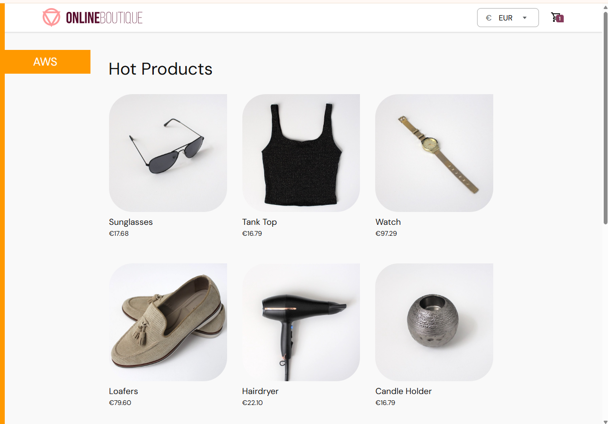

**Capture 2 — Panier**

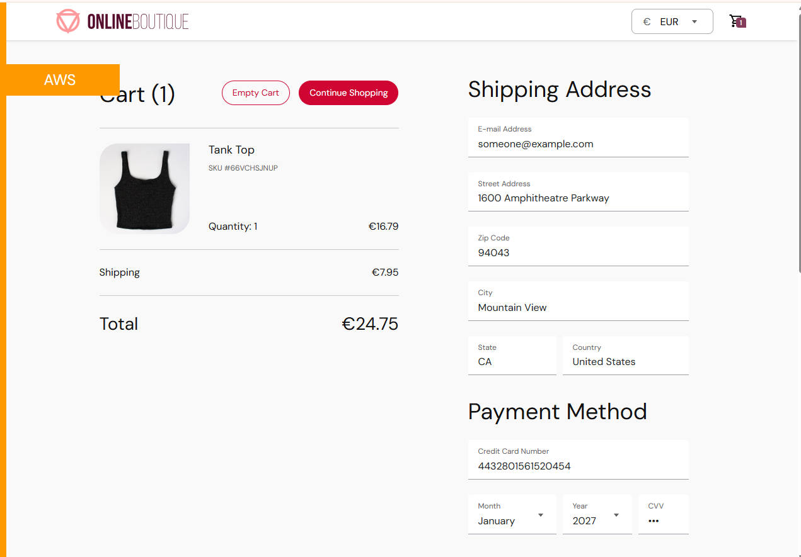

---

# Captures du pipeline

**Capture 3 — Pipeline GitHub Actions**

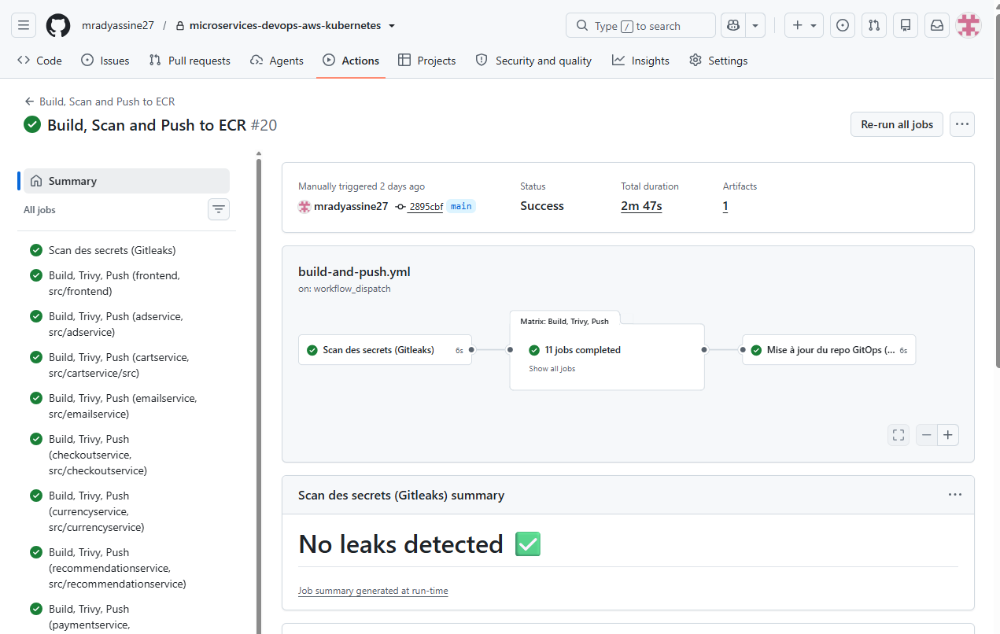

**Capture 4 — Argo CD (Healthy / Synced)**

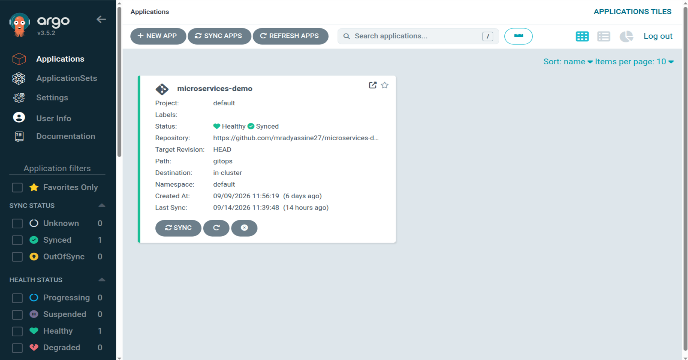

**Capture 5 — Dashboard Grafana**

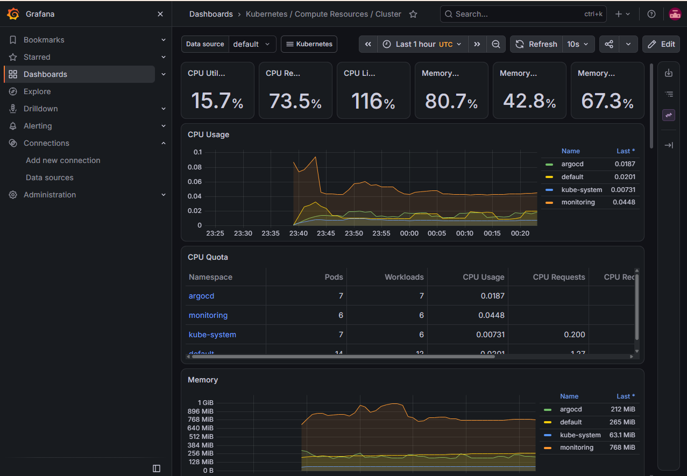

**Capture 6 — Alerte reçue sur Telegram**

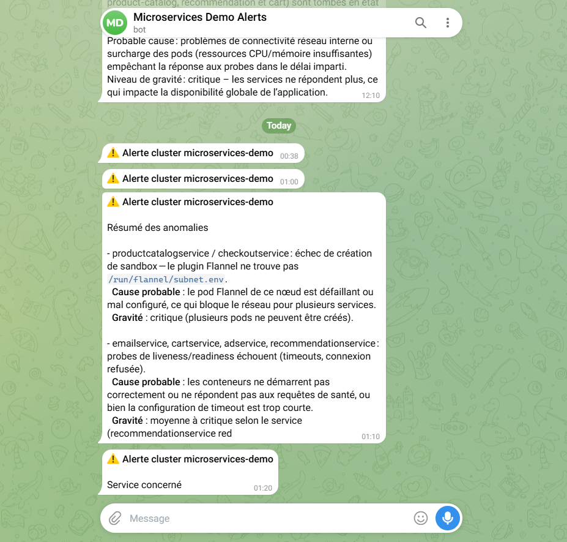

---

# Déploiement

## Prérequis

* Compte AWS
* Terraform (≥ 1.5)
* AWS CLI
* Une key pair EC2 existante
* Un bucket S3 pour le state Terraform (voir ci-dessous)

## 1. Cloner le repository

```bash
git clone git@github.com:mradyassine27/microservices-devops-aws-kubernetes.git
cd microservices-devops-aws-kubernetes
```

## 2. Créer le bucket S3 pour le state Terraform

```bash
aws s3api create-bucket \
  --bucket <ton-nom-de-bucket-unique> \
  --region eu-north-1 \
  --create-bucket-configuration LocationConstraint=eu-north-1
```

Mets à jour le nom du bucket dans `terraform/versions.tf`.

## 3. Configurer les variables

```bash
cd terraform
cp terraform.tfvars.example terraform.tfvars
```

Édite `terraform.tfvars` avec ton IP publique (`curl ifconfig.me`) et le nom de ta key pair SSH.

## 4. Créer l'infrastructure AWS

```bash
terraform init
terraform plan
terraform apply
```

k3s, Argo CD, Prometheus/Grafana et le credential provider ECR s'installent automatiquement (compter 5 à 10 minutes après la création de l'instance).

## 5. Configurer GitHub Actions

Dans les Settings du repo GitHub → Secrets and variables → Actions, ajouter :

| Secret | Valeur |
|---|---|
| `AWS_ROLE_ARN` | `terraform output github_actions_role_arn` |
| `AWS_ACCOUNT_ID` | Ton ID de compte AWS |
| `AWS_REGION` | `eu-north-1` |

## 6. Créer le Secret Kubernetes pour le bot Telegram

Sur l'instance EC2, en SSH :

```bash
sudo kubectl create secret generic telegram-bot-secrets \
  --from-literal=TELEGRAM_BOT_TOKEN="<ton-token>" \
  --from-literal=TELEGRAM_CHAT_ID="<ton-chat-id>" \
  --from-literal=GROQ_API_KEY="<ta-clé-groq>"
```

## 7. Exposer le frontend et Grafana (Ingress, sans tunnel)

Sur l'instance EC2 :

```bash
cat > frontend-ingress.yaml << 'EOF'
apiVersion: networking.k8s.io/v1
kind: Ingress
metadata:
  name: frontend-ingress
  namespace: default
spec:
  rules:
    - host: "<ip-avec-tirets>.nip.io"
      http:
        paths:
          - path: /
            pathType: Prefix
            backend:
              service:
                name: frontend
                port:
                  number: 80
EOF
sudo kubectl apply -f frontend-ingress.yaml
```

## 8. Déclencher le pipeline

```bash
git push
```

GitHub Actions build, scanne, pousse les images, met à jour `gitops/`. Argo CD synchronise automatiquement.

## 9. Accéder à l'application

```bash
terraform output instance_public_ip
```

Application accessible sur `http://<ip-avec-tirets>.nip.io`, sans tunnel.

---

# Ce que j'ai appris

## AWS OIDC et GitHub Actions

Le principal défi a été la configuration de l'authentification entre GitHub Actions et AWS sans clé permanente. Un changement récent de GitHub (format immuable du `sub` OIDC basé sur des IDs numériques plutôt que sur les noms) a nécessité d'adapter la trust policy IAM pour utiliser le format `repo:OWNER@OWNER_ID/REPO@REPO_ID:*`.

## Authentification ECR sans expiration

Un `imagePullSecret` classique expire toutes les 12h. La solution retenue a été de configurer un **credential provider** au niveau kubelet, s'appuyant directement sur le rôle IAM de l'instance — token toujours frais, aucune maintenance requise. Cette configuration a été intégrée directement dans le script de démarrage de l'instance pour rester reproductible à chaque recréation.

## Structure réelle des charts Helm

Une hypothèse initiale incorrecte (un champ `image` par microservice dans `values.yaml`) a conduit à un déploiement silencieusement figé sur l'ancienne version d'image. La vérification du code source des templates Helm a révélé que le chart utilise un unique champ global `images.repository`, combiné automatiquement avec le nom de chaque service.

## Débogage réseau et Kubernetes

La mise en place du monitoring a nécessité de déboguer plusieurs couches : kubeconfig introuvable par Helm sous `sudo`, credential provider non rechargé après une modification du service k3s, et une intégration Alertmanager → Telegram qui accepte les alertes en interne mais ne parvient pas encore à les délivrer, malgré une connectivité réseau confirmée à chaque niveau (token valide, DNS résolu depuis le pod, HTTPS fonctionnel). Cette dernière piste reste ouverte.

---

# Limitations connues

* L'intégration **Alertmanager → Telegram** est configurée (règles de seuils actives, alertes bien détectées et acceptées par Alertmanager) mais la livraison finale vers Telegram ne fonctionne pas encore. Le **bot de surveillance custom** (Kubernetes API → Groq → Telegram) reste le canal d'alerting principal et pleinement fonctionnel.
* `loadgenerator` reste désactivé (génère du trafic de test artificiel, sans utilité en usage réel).
* Les microservices Online Boutique n'exposent pas de métriques Prometheus applicatives nativement — le monitoring Prometheus couvre le niveau infrastructure uniquement.

---

# Améliorations futures

* [ ] Résoudre la livraison Alertmanager → Telegram
* [ ] HTTPS avec certificats TLS automatiques (cert-manager + Let's Encrypt)
* [ ] Ingress pour Argo CD (actuellement accessible via tunnel SSH uniquement)
* [ ] Dashboards Grafana personnalisés pour les microservices
* [ ] Progressive Delivery avec Argo Rollouts (Canary Deployment)
* [ ] Rollback automatique basé sur des métriques Prometheus

---

# Licence

Ce projet est basé sur **Google Online Boutique**, distribué sous licence **Apache License 2.0**. Les modifications et l'infrastructure DevOps ajoutées dans ce repository respectent la licence du projet original.